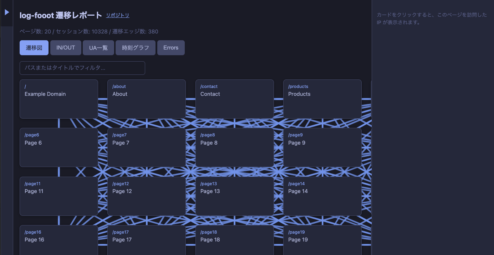

# log-fooot

nginx の COMBINED アクセスログを IP ごとに解析し、サイト内の画面遷移をカードと線で可視化するコマンドラインツールです。



## 機能

1. **サイトクロール**  
   指定した Web サイトをクロールし、URL 一覧と画面構成（パス・タイトル）を取得します。

2. **ログ解析**  
   nginx の COMBINED 形式のアクセスログをパースし、IP ごとにリクエスト時系列を構築します。

3. **可視化**  
   ページをカードとして表示し、ログから得られた「どの IP がどの順でページを見たか」を線で繋いだ HTML を出力します。  
   さらに、次のようなビューを切り替えて分析できます。
   - 遷移図: 画面カードと遷移線。カードやパスをクリックすると、右カラムに「そのページを閲覧した IP」と、その IP ごとの閲覧の流れを表示
   - IN/OUT: ページごとの「流入が多いページ」「流出が多いページ」の Top10 を横棒グラフで表示（パスをクリックすると右カラムに IP 一覧）
   - UA 一覧: User-Agent ごとのリクエスト件数ランキング
   - 時刻グラフ: 1時間ごとのリクエスト数を棒グラフで表示
   - エラー: HTTP 4xx/5xx をステータス別・IP 別に集計して表示（IP をクリックすると Google 検索を別タブで開く）

## 必要環境

- Python 3.9+
- （クロール時）対象サイトへの HTTP アクセス
- （ログ解析時）指定するログファイルへの読取権限（`/var/log/nginx/` は root 所有のため、ログを `/tmp` にコピーするか、実行ユーザを `adm` 等に追加する運用を推奨）

## インストール

```bash
git clone https://github.com/YOUR_USERNAME/log-fooot.git
cd log-fooot
pip install -r requirements.txt
# または
pip install -e .
```

### 仮想環境を使う場合（Ubuntu 24.04 など）

システムの Python が PEP 668 で保護されている場合は、venv を使います。

**Debian/Ubuntu で venv が未インストールの場合（ensurepip is not available と出る場合）:**

```bash
sudo apt install python3.12-venv   # または python3-venv
```

**その後:**

```bash
cd log-fooot
python3 -m venv .venv
.venv/bin/pip install -r requirements.txt
# 実行時は .venv/bin/python -m log_fooot ... を使う
.venv/bin/python -m log_fooot --base-url "https://example.com" --log-path /var/log/nginx/access.log --output-dir ./result
```

## 使い方

### 基本（クロール + ログ解析 + 可視化）

```bash
# サイトをクロールし、ログを解析して結果を output_dir に出力
python -m log_fooot \
  --base-url "https://example.com" \
  --log-path /var/log/nginx/access.log \
  --output-dir ./result
```

### オプション

| オプション | 説明 | 例 |
|-----------|------|-----|
| `--base-url` | クロール対象のベース URL | `https://example.com` |
| `--log-path` | nginx COMBINED ログファイルのパス | `/var/log/nginx/access.log` |
| `--output-dir` | 解析結果（JSON・HTML）を書き出すディレクトリ | `./result` |
| `--crawl-only` | クロールのみ実行し、sitemap を出力 | - |
| `--analyze-only` | 既存の sitemap を使いログ解析のみ | - |
| `--sitemap` | 既存 sitemap JSON のパス（`--analyze-only` 時） | `./result/sitemap.json` |
| `--max-pages` | クロールする最大ページ数（既定: 500） | `100` |
| `--session-gap-minutes` | 同一 IP でこの分数以上空いたら別セッション（既定: 30） | `15` |
| `--exclude-ips` | 集計から除外する IP を列挙したファイル（.txt または .csv） | `./exclude.csv` |
| `--output-sitemap` | sitemap の出力ファイル名またはパス | `sitemap.json` / `./out/sitemap.json` |
| `--output-sessions` | sessions の出力ファイル名またはパス | `sessions.json` |
| `--output-report` | レポート HTML の出力ファイル名またはパス | `report.html` / `/var/www/report.html` |
| `--lang` | レポートの表示言語（`en` / `ja`、既定: `en`） | `ja` |

- **出力ファイル名**: `--output-sitemap` / `--output-sessions` / `--output-report` でそれぞれの書き出し先を指定できます。ファイル名だけの場合は `--output-dir` の下に、パス（`/` や `\` を含む）の場合はそのパスに出力します。
- **除外 IP**: 未指定でも `--output-dir` に `exclude_ips.csv` があれば自動で読み込み、その IP はセッション集計に含めません。レポートの左サイドバーで除外一覧の確認・追加・CSV 取り込み・ダウンロードができます。

### 出力ファイル

- `sitemap.json` … クロールで得た URL 一覧・パス・タイトル
- `sessions.json` … IP 別のアクセス時系列・遷移パス
- `report.html` … カード＋遷移の線で可視化したレポート（ブラウザで開く）
- `exclude_ips.csv` … （任意）レポートでエクスポートした除外 IP をここに保存すると、次回から自動で読み込まれる

## ログ形式

nginx の **combined** 形式を想定しています。

```
log_format combined '$remote_addr - $remote_user [$time_local] '
                    '"$request" $status $body_bytes_sent '
                    '"$http_referer" "$http_user_agent"';
```

## サンプル

同梱の `sample_access.log` は nginx COMBINED 形式のサンプルです。sitemap を用意したうえで解析のみ試す例:

```bash
# 事前に result/sitemap.json を用意している場合
python -m log_fooot --analyze-only --log-path ./sample_access.log --output-dir ./result --sitemap ./result/sitemap.json
# result/report.html をブラウザで開く
```

### 大きなサンプルで試す（20 画面・15000 行）

```bash
# 20 画面の sitemap と 15000 行のログを生成
python scripts/generate_sample_log.py
# レポート生成
python -m log_fooot --analyze-only --log-path ./sample_access.log --output-dir ./result --sitemap ./result/sitemap.json
```

- `result/sitemap.json` は 20 画面用にあらかじめ用意済みです。
- `scripts/generate_sample_log.py` を実行すると `sample_access.log` が 15000 行で上書きされます。

## テスト

このリポジトリには、主に除外パス機能や可視化用ユーティリティを対象とした pytest ベースのテストが含まれています。

- 実行手順:

```bash
pip install -r requirements.txt   # まだの場合
pytest
```

- 主なテスト内容:
  - `tests/test_exclude_paths.py`: 除外パス/ファイルの読み書き・判定ロジック
  - `tests/test_visualize_utils.py`: IN/OUT 集計、エラー集計、`excluded_paths` による表示除外の確認

## ライセンス

MIT License（[LICENSE](LICENSE)）

## 開発メモ（コントリビュート）

このリポジトリでは、コミットメッセージに **Conventional Commits** 形式を採用しています。詳しくはルートにある `.cursorrules` を参照してください。

- **type の例**: `feat`, `fix`, `docs`, `refactor`, `test`, `chore` など  
- **scope の例**: `cli`, `crawl`, `sessions`, `visualize`, `logparser`, `exclude`, `sample`, `docs`, `config`, `deps` など  
- **形式**:  
  - `feat(visualize): エラータブで IP ごとの 4xx/5xx を可視化する`

PR を送る場合は、上記ルールに沿ったコミットメッセージを付けてもらえると助かります。

## 免責

本ソフトウェアは「現状のまま」提供されます。利用に伴う不具合・損害等について、作者は一切の責任を負いません。

**クロール機能について**: 本ツールは任意の URL を指定してクロールできますが、**クロールは対象サイトの管理者の許可を得たうえで、利用規約・robots.txt・法令等に従って利用するものとします**。第三者のサイトを無断でクロールしたことによる問題・損害・請求等について、作者は一切の責任を負いません。利用は自己責任で行ってください。